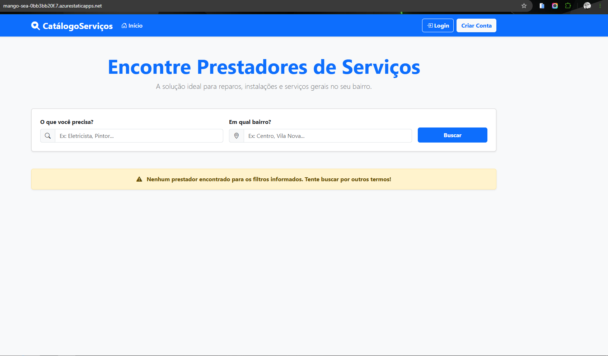
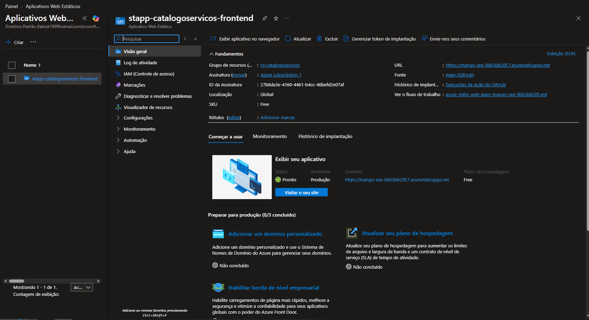
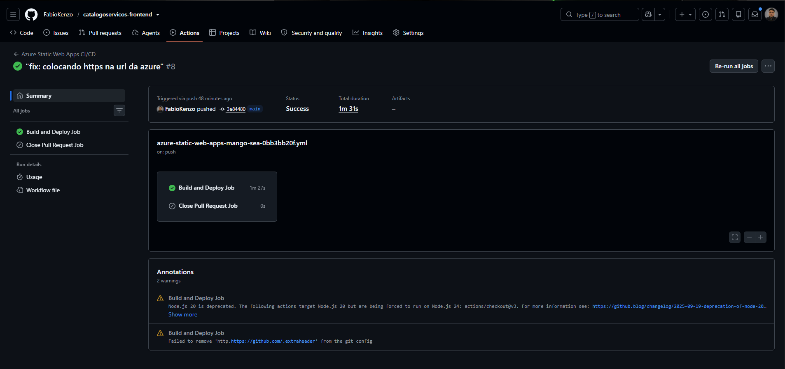

# CatálogoServiços - Frontend 💻🚀

Frontend desenvolvido em **Angular 17**, **TypeScript** e **Bootstrap 5** para a plataforma **CatálogoServiços**, um sistema web que conecta moradores a prestadores de serviços locais de forma rápida, gratuita e acessível.

O projeto foi desenvolvido como parte das atividades de **Extensão Universitária da UNITAU**, aplicando conceitos de desenvolvimento Full Stack para solucionar um problema real da comunidade: a dificuldade de encontrar profissionais autônomos qualificados na região.

---

# 🌐 Aplicação Online

## Aplicação em Produção

**Frontend (Produção):**

https://catalogoservicos-frontend.netlify.app/

**Backend API:**

Java 21 + Spring Boot + MySQL hospedados em nuvem.

---

# 🎯 O Problema

Muitos profissionais autônomos dependem exclusivamente de indicações para conseguir clientes.

Ao mesmo tempo, moradores frequentemente têm dificuldade em encontrar prestadores confiáveis para serviços do dia a dia, como:

- Eletricistas
- Encanadores
- Pintores
- Diaristas
- Jardineiros
- Pedreiros
- Técnicos em manutenção

O CatálogoServiços foi criado para aproximar esses dois públicos através de uma plataforma simples, intuitiva e totalmente digital.

---

# 🚀 Como Funciona

## 👤 Cliente

- Criar uma conta gratuitamente
- Fazer login na plataforma
- Pesquisar profissionais por categoria
- Filtrar resultados por bairro
- Visualizar informações dos prestadores
- Entrar em contato diretamente pelo WhatsApp

## 🛠️ Prestador

- Criar uma conta
- Fazer login
- Cadastrar seu perfil profissional
- Informar categoria de atuação
- Informar bairro
- Adicionar descrição dos serviços
- Disponibilizar contato via WhatsApp

---

# ✨ Funcionalidades

- Busca dinâmica por categoria
- Busca dinâmica por bairro
- Filtros combinados
- Cadastro de usuários
- Login de usuários
- Cadastro de prestadores
- Integração com API REST
- Exibição dinâmica de cards
- Interface responsiva
- Navegação SPA (Single Page Application)

---

# 📱 Melhorias para Dispositivos Móveis

Durante os testes em smartphones Android e iPhone foram implementadas otimizações específicas para melhorar a experiência do usuário:

- Sanitização de entradas utilizando `.trim()`
- Fechamento automático do teclado virtual após pesquisas
- Ajustes de eventos para melhor resposta ao toque
- Correções de comportamento em navegadores mobile

Essas melhorias garantem uma experiência consistente em diferentes dispositivos e sistemas operacionais.

---

# 🛠️ Tecnologias Utilizadas

## Frontend

- Angular 17
- TypeScript
- HTML5
- CSS3
- Bootstrap 5
- Angular Forms
- Angular HttpClient

## Infraestrutura

- Netlify (Deploy e hospedagem)
- GitHub (Versionamento)
- API REST Spring Boot

---

# ☁️ Deploy e Infraestrutura na Microsoft Azure

Como parte do meu aprendizado em **Cloud Computing**, **DevOps** e preparação para a certificação **Microsoft Azure AZ-900**, esta aplicação também passou por um processo completo de implantação na **Microsoft Azure**, permitindo validar na prática a publicação de aplicações Front-end em ambiente de produção e a automação do processo de entrega contínua.

## 🏗️ Infraestrutura Utilizada

- Microsoft Azure Static Web Apps
- GitHub Actions
- Azure Resource Group
- GitHub
- Angular 17

---

## 🚀 Evidências do Deploy na Nuvem

Durante a implantação da aplicação foram validadas todas as etapas necessárias para disponibilização do sistema em ambiente cloud.

### 1️⃣ Aplicação em Produção

Aplicação Angular publicada e executando em ambiente de produção através do Azure Static Web Apps.





*Aplicação publicada na Microsoft Azure.*

---

### 2️⃣ Provisionamento da Infraestrutura

Criação do recurso **Azure Static Web Apps** no Portal da Microsoft Azure, demonstrando a infraestrutura responsável pela hospedagem da aplicação.





*Provisionamento da infraestrutura na Microsoft Azure.*

---

### 3️⃣ Pipeline de CI/CD

Workflow automatizado utilizando GitHub Actions.

A cada novo **push** realizado para a branch principal, o pipeline executa automaticamente:

- Instalação das dependências
- Build da aplicação Angular
- Publicação na Azure Static Web Apps





*Pipeline executando o Build e Deploy automaticamente.*

---

## 🎯 Competências Demonstradas

Durante este processo foram aplicados conhecimentos em:

- Microsoft Azure
- Azure Static Web Apps
- GitHub Actions
- CI/CD
- Deploy de aplicações Front-end
- Cloud Computing
- Versionamento com GitHub
- Build automatizado
- Publicação de aplicações Angular
- DevOps Fundamentals

---

# 🏗️ Arquitetura da Aplicação

```text
Usuário
   │
   ▼
Frontend Angular
   │
   ▼
API REST Spring Boot
   │
   ▼
MySQL
```

---

# 📂 Estrutura do Projeto

```text
src/
└── app/
    ├── components/
    │   ├── busca-servicos/
    │   ├── cadastro/
    │   ├── login/
    │   ├── navbar/
    │   └── painel-prestador/
    │
    └── services/
        └── api.service.ts
```

---

# 🚀 Executando Localmente

## Pré-requisitos

- Node.js 18 ou superior
- Angular CLI

Instale o Angular CLI:

```bash
npm install -g @angular/cli
```

## Clone o repositório

```bash
git clone https://github.com/FabioKenzo/catalogoservicos-frontend.git

cd catalogoservicos-frontend
```

## Instale as dependências

```bash
npm install
```

## Execute o servidor local

```bash
ng serve
```

A aplicação estará disponível em:

```text
http://localhost:4200
```

---

# 🎓 Projeto de Extensão Universitária

Este projeto foi desenvolvido como parte das atividades de **Extensão Universitária** do curso de **Análise e Desenvolvimento de Sistemas (ADS)** da **Universidade de Taubaté (UNITAU)**.

O objetivo foi aplicar conhecimentos de Engenharia de Software, Desenvolvimento Web e Arquitetura Full Stack para criar uma solução tecnológica capaz de gerar impacto positivo na comunidade local.

---

# 👨‍💻 Desenvolvedor

## Fábio Kenzo Okamura

Estudante de Análise e Desenvolvimento de Sistemas (ADS) — Universidade de Taubaté (UNITAU)

---

# 🔗 Projeto Relacionado

Backend da aplicação:

https://github.com/FabioKenzo/catalogoservicos
